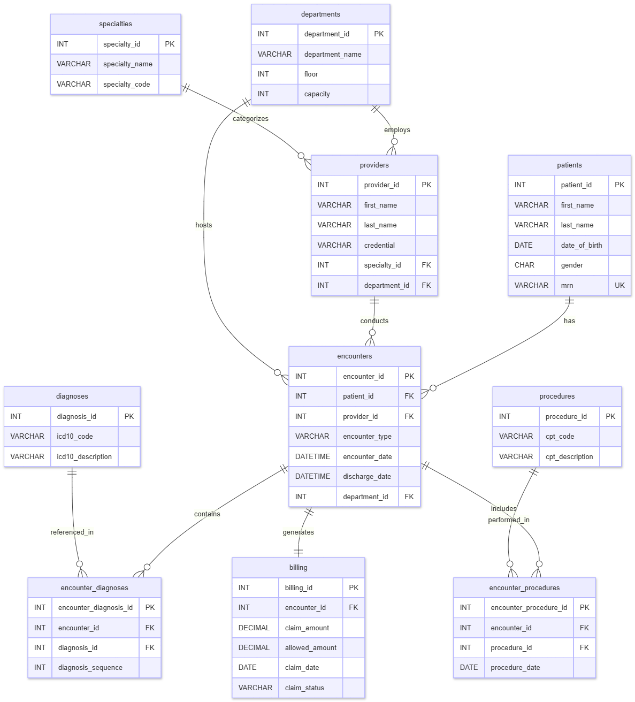
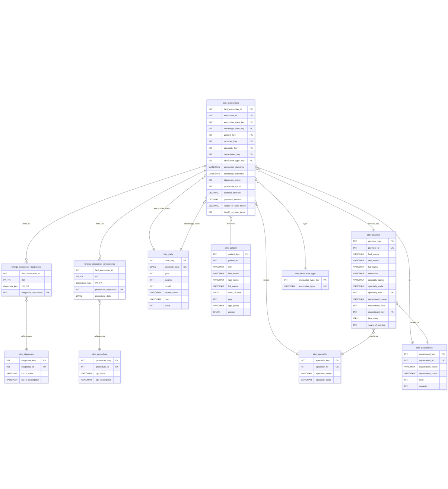

# Data Modeling and Storage Project

This project focuses on designing and implementing a star schema for healthcare data, along with defining the Extract, Transform, Load (ETL) process and analyzing query performance.

## Project Overview

The primary goal of this project is to transform a normalized OLTP (Online Transaction Processing) healthcare database into a star schema suitable for analytical workloads. This involves:

- **Star Schema Design:** Defining fact and dimension tables, including grain, hierarchies, and pre-aggregated metrics.
- **ETL Design:** Outlining the logic for loading data into the star schema, covering dimension loading, fact table loading, and bridge table loading strategies, as well as refresh strategies and handling of late-arriving facts.
- **Query Analysis:** Comparing the performance of key analytical queries on both the original OLTP schema and the newly designed star schema.
- **Reflection:** Analyzing the trade-offs, benefits, and challenges of implementing a star schema, especially concerning join complexity, pre-computation, denormalization, and the use of bridge tables.

## Project Structure

- `design_decisions.txt`: Details the key design choices made for the star schema, including fact table grain, dimension table structures, pre-aggregated metrics, and bridge table rationale.
- `etl_design.txt`: Describes the ETL process for populating the star schema, covering dimension load logic, fact table load logic, bridge table load logic, and refresh strategies.
- `query_analysis.txt`: Contains an analysis of sample OLTP queries, identifying performance bottlenecks.
- `star_schema_queries.txt`: Provides the star schema versions of the analytical queries and their performance measurements, demonstrating the improvements.
- `star_schema.sql`: (Assumed to contain the DDL for the star schema, though not explicitly read, it's a common output for such a project)
- `reflection.md`: A detailed reflection on the project, discussing the advantages and disadvantages of the star schema, performance quantification, and the utility of bridge tables.
- `README.md`: This file, providing an overview of the project.

## Key Concepts Explored

- **Star Schema:** A dimensional model optimized for querying large data sets.
- **Fact Tables:** Contain quantitative data for analysis.
- **Dimension Tables:** Contain descriptive attributes related to the facts.
- **ETL (Extract, Transform, Load):** The process of moving data from source systems to the data warehouse.
- **Bridge Tables:** Used to handle many-to-many relationships in a dimensional model.
- **Query Performance Optimization:** Techniques to improve the speed of analytical queries.
- **Denormalization:** The process of adding redundant data to a database to improve performance.

## Usage

To understand the project, it is recommended to review the documents in the following order:

1. `design_decisions.txt`: To grasp the foundational design choices.
2. `etl_design.txt`: To understand how data is populated into the schema.
3. `query_analysis.txt`: To see the initial OLTP query performance issues.
4. `star_schema_queries.txt`: To observe the improved performance with the star schema.
5. `reflection.md`: For a comprehensive analysis and summary of the project's outcomes and learnings.
6. `star_schema.sql`: To review the actual schema definition (if available).

This project serves as a practical demonstration of applying data warehousing principles to improve analytical query performance on healthcare data.

## ERD Diagrams

### Original OLTP Schema

### Star Schema ERD
